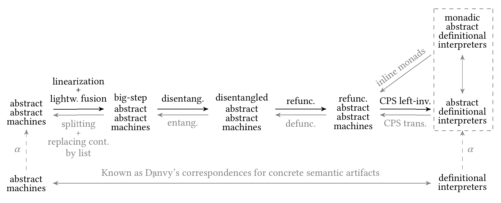

# Refunctionalization of Abstract Abstract Machines

This directory contains the artifact for the ICFP '18 submission "Refunctionalization of Abstract Abstract Machines (Functional Pearl)".

Link: https://github.com/Kraks/RefuncAAM

## Abstract

Abstracting abstract machines is a systematic methodology for constructing sound static analyses for higher-order languages, by deriving small-step abstract abstract machines that perform abstract interpretation from abstract machines that perform concrete evaluation. Darais et al. apply the same underlying idea to monadic definitional interpreters, and obtain monadic abstract definitional interpreters that perform abstract interpretation in big-step style using monads. Yet, the relation between small-step abstract abstract machines and big-step abstract definitional interpreters is not well studied.

In this paper, we explain their functional correspondence and demonstrate how to syntactically transform small-step abstract abstract machines into big-step abstract definitional interpreters. Building on known semantic interderivation techniques from the concrete evaluation setting, the transformations include linearization, lightweight fusion, disentanglement, refunctionalization, and the left inverse of the CPS transform. Linearization expresses nondeterministic choice through first-order data types, after which refunctionalization transforms the first-order data types that represent continuations into higher-order functions. The refunctionalized AAM is an abstract interpreter written in continuation-passing style (CPS) with two layers of continuations, which can be converted back to direct style with delimited control operators. Based on the known correspondence between delimited control and monads, we demonstrate that the explicit use of monads in abstract definitional interpreters is optional.

All transformations properly handle the collecting semantics and nondeterminism of abstract interpretation. Remarkably, we reveal how precise call/return matching in control-flow analysis can be obtained by refunctionalizing a small-step abstract abstract machine with proper caching.

## Getting Started

You should have Oracle JDK (>= 8) and `sbt` (>= 0.13) installed. Other dependencies of Scala and libraries are specified in `build.sbt`.

### To compile
```
  sbt compile
```

### To test
```
  sbt test
```

### To generate the paper
```
  cd paper
  make
```

## Step-by-Step Instructions

### Relations to the Paper



This artifact contains Scala implementations that correspond to semantic artifacts in the above transformation diagram.

#### Section 2.1

The abstract syntax are specified in file `src/main/scala/refunc/ast/Expr.scala`. For the convenience of testing, we implement an extended abstract syntax in ANF comparing with the one described in the paper: 1) Integers as atomic expressions are supported. 2) To create recursive bindings, the users may use `letrec`.

#### Section 2.2

In the transformation diagram, the starting point at the bottom left corner is concrete _abstract machines_. `src/main/scala/refunc/concrete/CESK.scala` contains a concrete CESK machine implementation (object `CESK`), and also a refunctionalized definitional interpreter in continuation-passing style (object `RefuncCESK`).

#### Section 2.3

A standard _abstract abstract machine (AAM)_ is implemented object `SmallStep` in `src/main/scala/refunc/SmallStep.scala`. The basic code structures shared by the rest abstract machines and abstract interpreters are contained in `src/main/scala/refunc/ANFAAMBasis.scala`.

#### Section 2.4

We implement a variant of abstract abstract machines -- AAM with unbounded stack in `src/main/scala/refunc/SmallStepUB.scala`. This artifact forms the beginning of transformations shown in the paper.

#### Section 3

The linearized AAM with unbounded stack (UB) is implemented in `src/main/scala/refunc/LinearSmallStepUB.scala`.

#### Section 4

By applying fusing transformation on the linearized AAM with UB, we show the fused AAM in `src/main/scala/refunc/FusedLinearSmallStepUB.scala`.

#### Section 5

The disentangled AAM is implemented in `src/main/scala/refunc/DisentangledLinearSmallStepUB.scala`, which identifies the first-order data type representing continuations in the abstract abstract machines. 

#### Section 6

The vanilla implementation of refunctionalized AAM is object `RefuncECPS` in `src/main/scala/refunc/RefuncECPS.scala`, which only transforms the first-order data types representing continuations to higher-order functions. Section 6.2 describes a simplified refunctionalized AAM that utilizes caching and `nd` operator is implemented in `src/main/scala/refunc/RefuncCPS.scala`.

Additionally, as a reference of sound pushdown control-flow analysis, AAM with P4F allocator is implemented in `src/main/scala/refunc/SmallStepP4F.scala`. We use this to further test the pushdown control-flow property of our refunctionalized AAM.

#### Section 7

By representing the extended continuation-passing style with delimited control operators, we implement a direct-style abstract interpreter in object `DirectStyleDC` of file `src/main/scala/refunc/DirectStyle.scala`.

### Tests

To concretely establish the correspondences, we provide a set of programs and test the equivalence of analyzed results from every abstract interpreter in our transformations. For details of testing criteria, see `src/test/scala/refunc/Test.scala`.
